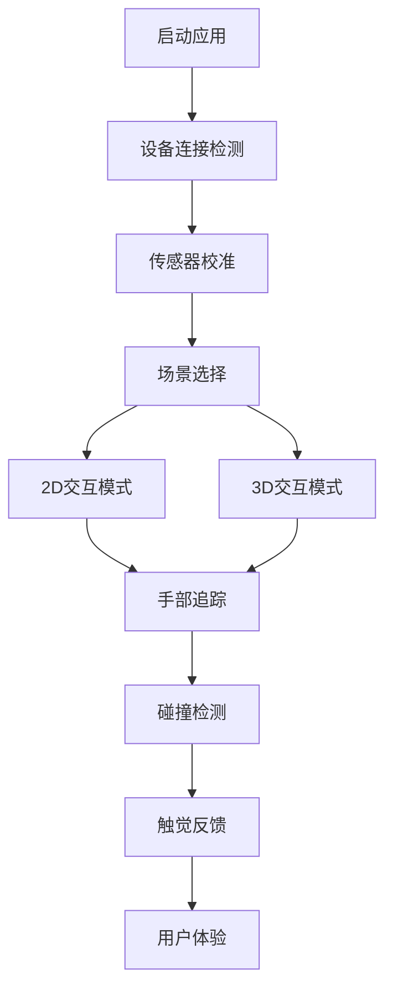

# 指套触感反馈系统产品需求文档

## 1. 产品概述

本产品是一个基于指套硬件和手机摄像头的触感反馈系统，通过SLAM定位、手势识别和物理碰撞检测，实现用户与虚拟物体的真实触觉交互体验。

系统解决了虚拟现实和增强现实中缺乏触觉反馈的问题，为用户提供多模态的触感体验，包括力反馈、温度反馈和纹理摩擦反馈。

产品目标是打造下一代人机交互界面，在教育培训、医疗康复、游戏娱乐等领域具有广阔的市场应用前景。

## 2. 核心功能

### 2.1 用户角色

| 角色 | 注册方式 | 核心权限 |
|------|----------|----------|
| 普通用户 | 手机号注册 | 可使用基础触感反馈功能，体验预设虚拟物体 |
| 开发者用户 | 邀请码升级 | 可创建自定义虚拟物体，调整触感参数，访问API接口 |

### 2.2 功能模块

我们的指套触感反馈系统包含以下主要页面：

1. **主页面**：系统状态监控、设备连接管理、场景选择
2. **校准页面**：指套传感器校准、相机标定、触感强度调节
3. **体验页面**：2D/3D虚拟物体交互、实时触感反馈显示
4. **设置页面**：系统参数配置、性能优化选项、数据导出

### 2.3 页面详情

| 页面名称 | 模块名称 | 功能描述 |
|----------|----------|----------|
| 主页面 | 设备状态监控 | 显示指套连接状态、电池电量、传感器工作状态，提供快速诊断功能 |
| 主页面 | 场景选择器 | 提供2D平面交互、3D空间交互等不同体验模式，支持自定义场景导入 |
| 校准页面 | 传感器校准 | 指导用户完成IMU零点校准、弯曲传感器范围标定、相机内外参标定 |
| 校准页面 | 触感调节 | 允许用户自定义振动强度、温度范围、反馈延迟等个性化参数 |
| 体验页面 | 手部追踪显示 | 实时显示手部21个关键点位置、指尖轨迹、手势识别结果 |
| 体验页面 | 虚拟物体渲染 | 在2D/3D空间中渲染虚拟物体，支持不同材质属性（硬度、纹理、温度） |
| 体验页面 | 碰撞检测引擎 | 实时计算指尖与虚拟物体的碰撞状态，触发相应的触觉反馈 |
| 体验页面 | 触感反馈控制 | 根据碰撞信息生成振动、温度、纹理等多模态触觉指令 |
| 设置页面 | 性能监控 | 显示系统帧率、延迟统计、CPU/GPU使用率、内存占用情况 |
| 设置页面 | 参数配置 | 调整SLAM精度、追踪算法选择、物理引擎参数、通信协议设置 |

## 3. 核心流程

### 普通用户体验流程
1. 用户佩戴指套设备并启动手机应用
2. 系统自动检测并连接指套硬件
3. 进入校准页面完成传感器标定
4. 选择2D平面交互场景开始体验
5. 手机摄像头实时追踪手部运动
6. 系统检测指尖与虚拟物体的碰撞
7. 指套提供相应的触觉反馈

### 开发者用户流程
1. 开发者登录并进入高级设置模式
2. 创建自定义虚拟物体并设置材质属性
3. 调整碰撞检测参数和触感映射规则
4. 测试并优化触觉反馈效果
5. 导出配置文件或通过API集成到其他应用

## 4. 用户界面设计

### 4.1 设计风格

- **主色调**：科技蓝 (#2563EB) 和纯白 (#FFFFFF)
- **辅助色**：警告橙 (#F59E0B) 和成功绿 (#10B981)
- **按钮样式**：圆角矩形，支持3D按压效果和触觉反馈预览
- **字体**：主标题使用 24px 粗体，正文使用 16px 常规字体
- **布局风格**：卡片式设计，顶部导航栏，支持手势操作
- **图标风格**：线性图标配合适当的动画效果，体现科技感

### 4.2 页面设计概览

| 页面名称 | 模块名称 | UI元素 |
|----------|----------|--------|
| 主页面 | 设备状态卡片 | 圆形进度条显示电池电量，彩色指示灯显示连接状态，实时数据流动画 |
| 主页面 | 场景选择网格 | 3x2网格布局，每个场景配有预览图和描述文字，支持滑动切换 |
| 校准页面 | 校准向导 | 步骤指示器，3D手部模型指导，实时传感器数据可视化 |
| 体验页面 | 相机预览窗口 | 全屏相机画面，叠加手部关键点标记，虚拟物体半透明渲染 |
| 体验页面 | 触感强度指示器 | 环形进度条，实时显示当前触觉反馈强度，支持颜色渐变 |
| 设置页面 | 参数滑块组 | 分组的滑块控件，实时预览效果，支持数值输入和预设选择 |

### 4.3 响应式设计

产品主要面向移动端设计，支持竖屏和横屏模式自适应。在横屏模式下，相机预览窗口占据更大空间以提供更好的交互体验。同时考虑触摸操作优化，所有交互元素的最小点击区域为44px。