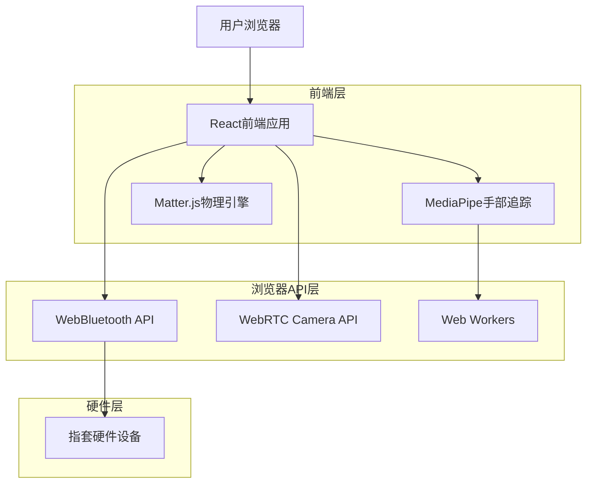
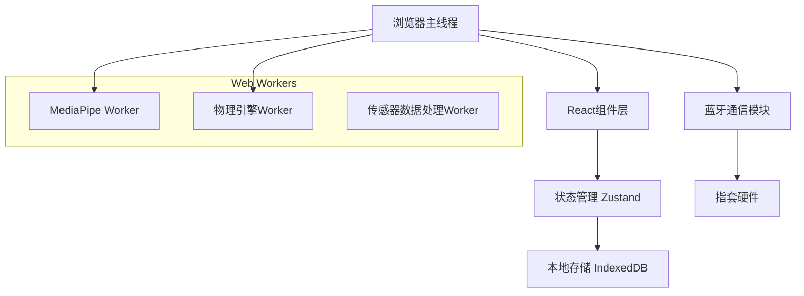
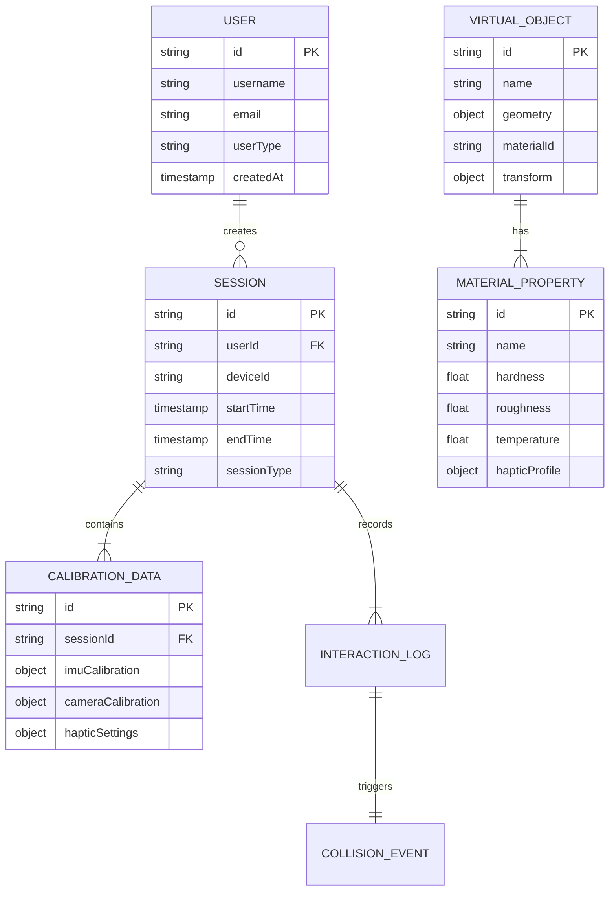

# 指套触感反馈系统技术架构文档

## 1. 架构设计



## 2. 技术描述

- **前端**: React@18 + TypeScript@5 + Vite@5 + TailwindCSS@3
- **手部追踪**: MediaPipe Hands + TensorFlow.js@4
- **物理引擎**: Matter.js@0.19 (2D场景) + Cannon.js@2 (3D场景)
- **硬件通信**: Web Bluetooth API + 自定义协议
- **性能优化**: Web Workers + OffscreenCanvas + WASM

## 3. 路由定义

| 路由 | 用途 |
|------|------|
| / | 主页面，显示设备状态和场景选择 |
| /calibration | 校准页面，完成传感器和相机标定 |
| /experience/2d | 2D平面交互体验页面 |
| /experience/3d | 3D空间交互体验页面 |
| /settings | 设置页面，系统参数配置和性能监控 |
| /developer | 开发者页面，自定义物体和API测试 |

## 4. API定义

### 4.1 核心API

#### 设备连接管理
```typescript
// 设备连接
POST /api/device/connect
```

请求:
| 参数名 | 参数类型 | 是否必需 | 描述 |
|--------|----------|----------|------|
| deviceId | string | true | 指套设备的蓝牙MAC地址 |
| deviceType | string | true | 设备型号标识 |

响应:
| 参数名 | 参数类型 | 描述 |
|--------|----------|------|
| connected | boolean | 连接状态 |
| batteryLevel | number | 电池电量百分比 |
| firmwareVersion | string | 固件版本号 |

示例:
```json
{
  "deviceId": "AA:BB:CC:DD:EE:FF",
  "deviceType": "FingerSuit_V2"
}
```

#### 传感器数据获取
```typescript
// 获取实时传感器数据
GET /api/sensors/data
```

响应:
| 参数名 | 参数类型 | 描述 |
|--------|----------|------|
| imu | IMUData | IMU传感器数据（加速度、角速度、磁力计） |
| flex | FlexData | 弯曲传感器数据（各关节角度） |
| timestamp | number | 数据时间戳 |

#### 触觉反馈控制
```typescript
// 发送触觉反馈指令
POST /api/haptic/feedback
```

请求:
| 参数名 | 参数类型 | 是否必需 | 描述 |
|--------|----------|----------|------|
| vibration | VibrationConfig | false | 振动反馈配置 |
| temperature | TemperatureConfig | false | 温度反馈配置 |
| duration | number | true | 反馈持续时间(ms) |

#### 手部追踪数据
```typescript
// 手部关键点检测结果
interface HandLandmarks {
  landmarks: Array<{x: number, y: number, z: number}>;
  handedness: 'Left' | 'Right';
  confidence: number;
  timestamp: number;
}
```

#### 碰撞检测事件
```typescript
// 碰撞检测结果
interface CollisionEvent {
  objectId: string;
  contactPoint: {x: number, y: number};
  force: number;
  material: MaterialType;
  timestamp: number;
}
```

## 5. 服务器架构图

由于采用纯前端架构，主要的计算和处理都在浏览器端完成：



## 6. 数据模型

### 6.1 数据模型定义



### 6.2 数据定义语言

由于采用纯前端架构，数据存储使用浏览器的IndexedDB：

```javascript
// 用户会话数据存储
const sessionStore = {
  name: 'HapticSessions',
  version: 1,
  stores: {
    users: {
      keyPath: 'id',
      autoIncrement: false,
      indexes: {
        email: { unique: true },
        username: { unique: true }
      }
    },
    sessions: {
      keyPath: 'id',
      autoIncrement: false,
      indexes: {
        userId: { unique: false },
        startTime: { unique: false }
      }
    },
    calibrationData: {
      keyPath: 'id',
      autoIncrement: false,
      indexes: {
        sessionId: { unique: true }
      }
    },
    virtualObjects: {
      keyPath: 'id',
      autoIncrement: false,
      indexes: {
        name: { unique: false },
        materialId: { unique: false }
      }
    },
    interactionLogs: {
      keyPath: 'id',
      autoIncrement: true,
      indexes: {
        sessionId: { unique: false },
        timestamp: { unique: false },
        objectId: { unique: false }
      }
    }
  }
};

// 初始化预设虚拟物体
const defaultVirtualObjects = [
  {
    id: 'stone_01',
    name: '石头',
    geometry: { type: 'circle', radius: 50 },
    material: {
      hardness: 0.9,
      roughness: 0.7,
      temperature: 20,
      hapticProfile: {
        vibration: { intensity: 0.8, frequency: 200, duration: 100 },
        temperature: { target: 18, rampTime: 500 }
      }
    },
    transform: { x: 200, y: 200, rotation: 0 }
  },
  {
    id: 'sponge_01',
    name: '海绵',
    geometry: { type: 'rectangle', width: 80, height: 60 },
    material: {
      hardness: 0.2,
      roughness: 0.3,
      temperature: 25,
      hapticProfile: {
        vibration: { intensity: 0.3, frequency: 50, duration: 300 },
        temperature: { target: 28, rampTime: 1000 }
      }
    },
    transform: { x: 400, y: 200, rotation: 0 }
  }
];

// 性能监控数据结构
const performanceMetrics = {
  frameRate: 0,
  trackingLatency: 0,
  hapticLatency: 0,
  cpuUsage: 0,
  memoryUsage: 0,
  batteryLevel: 100,
  connectionQuality: 'excellent'
};
```

## 7. YOLO11目标检测与3D物体交互系统

### 7.1 YOLO11物体检测集成方案

#### 7.1.1 YOLO11模型配置与部署

```typescript
// YOLO11配置
const yolo11Config = {
  modelPath: '/models/yolo11n.onnx',  // YOLO11 Nano版本，适合移动端
  inputSize: [640, 640],             // 输入尺寸
  confidenceThreshold: 0.5,          // 置信度阈值
  iouThreshold: 0.4,                 // NMS IoU阈值
  maxDetections: 100,                // 最大检测数量
  targetClasses: [                   // 目标类别
    'person', 'cup', 'bottle', 'book', 'laptop', 
    'mouse', 'keyboard', 'cell phone', 'apple', 'orange'
  ]
};

// ONNX.js运行时配置
const onnxConfig = {
  executionProviders: [
    'webgl',     // GPU加速（优先）
    'wasm',      // WebAssembly后备
    'cpu'        // CPU后备
  ],
  graphOptimizationLevel: 'all',
  enableCpuMemArena: true,
  enableMemPattern: true
};
```

#### 7.1.2 YOLO11推理引擎

```typescript
// YOLO11检测器类
class YOLO11Detector {
  private session: ort.InferenceSession | null = null;
  private inputTensor: ort.Tensor | null = null;
  
  async initialize() {
    try {
      // 加载ONNX模型
      this.session = await ort.InferenceSession.create(
        yolo11Config.modelPath, 
        onnxConfig
      );
      
      console.log('YOLO11模型加载成功');
      return true;
    } catch (error) {
      console.error('YOLO11模型加载失败:', error);
      return false;
    }
  }
  
  async detect(imageData: ImageData): Promise<Detection[]> {
    if (!this.session) {
      throw new Error('模型未初始化');
    }
    
    // 1. 图像预处理
    const preprocessedData = this.preprocessImage(imageData);
    
    // 2. 创建输入张量
    const inputTensor = new ort.Tensor('float32', preprocessedData, [1, 3, 640, 640]);
    
    // 3. 模型推理
    const outputs = await this.session.run({ images: inputTensor });
    
    // 4. 后处理检测结果
    const detections = this.postprocessOutputs(outputs.output0.data as Float32Array);
    
    return detections;
  }
  
  private preprocessImage(imageData: ImageData): Float32Array {
    const { width, height, data } = imageData;
    const inputSize = yolo11Config.inputSize[0];
    
    // 创建canvas进行尺寸调整
    const canvas = document.createElement('canvas');
    const ctx = canvas.getContext('2d')!;
    canvas.width = inputSize;
    canvas.height = inputSize;
    
    // 保持宽高比的resize
    const scale = Math.min(inputSize / width, inputSize / height);
    const scaledWidth = width * scale;
    const scaledHeight = height * scale;
    const offsetX = (inputSize - scaledWidth) / 2;
    const offsetY = (inputSize - scaledHeight) / 2;
    
    // 绘制并获取像素数据
    const imageCanvas = new ImageData(data, width, height);
    const bitmap = createImageBitmap(imageCanvas);
    ctx.drawImage(await bitmap, offsetX, offsetY, scaledWidth, scaledHeight);
    
    const resizedData = ctx.getImageData(0, 0, inputSize, inputSize).data;
    
    // 转换为CHW格式并归一化
    const float32Data = new Float32Array(3 * inputSize * inputSize);
    for (let i = 0; i < inputSize * inputSize; i++) {
      float32Data[i] = resizedData[i * 4] / 255.0;                    // R
      float32Data[i + inputSize * inputSize] = resizedData[i * 4 + 1] / 255.0;     // G
      float32Data[i + 2 * inputSize * inputSize] = resizedData[i * 4 + 2] / 255.0; // B
    }
    
    return float32Data;
  }
  
  private postprocessOutputs(outputs: Float32Array): Detection[] {
    const detections: Detection[] = [];
    const numDetections = outputs.length / 84; // YOLO11输出格式：[x, y, w, h, conf, ...classes]
    
    for (let i = 0; i < numDetections; i++) {
      const offset = i * 84;
      const confidence = outputs[offset + 4];
      
      if (confidence < yolo11Config.confidenceThreshold) continue;
      
      // 获取类别概率
      let maxClassProb = 0;
      let classId = 0;
      for (let j = 5; j < 84; j++) {
        if (outputs[offset + j] > maxClassProb) {
          maxClassProb = outputs[offset + j];
          classId = j - 5;
        }
      }
      
      const finalConfidence = confidence * maxClassProb;
      if (finalConfidence < yolo11Config.confidenceThreshold) continue;
      
      // 边界框坐标转换
      const x = outputs[offset];
      const y = outputs[offset + 1];
      const w = outputs[offset + 2];
      const h = outputs[offset + 3];
      
      detections.push({
        classId,
        className: this.getClassName(classId),
        confidence: finalConfidence,
        bbox: {
          x: x - w / 2,
          y: y - h / 2,
          width: w,
          height: h
        }
      });
    }
    
    // 非极大值抑制
    return this.applyNMS(detections);
  }
  
  private applyNMS(detections: Detection[]): Detection[] {
    // 按置信度排序
    detections.sort((a, b) => b.confidence - a.confidence);
    
    const keep: boolean[] = new Array(detections.length).fill(true);
    
    for (let i = 0; i < detections.length; i++) {
      if (!keep[i]) continue;
      
      for (let j = i + 1; j < detections.length; j++) {
        if (!keep[j]) continue;
        
        const iou = this.calculateIoU(detections[i].bbox, detections[j].bbox);
        if (iou > yolo11Config.iouThreshold) {
          keep[j] = false;
        }
      }
    }
    
    return detections.filter((_, index) => keep[index]);
  }
}
```

### 7.2 3D物体位置检测技术栈

#### 7.2.1 AR定位与深度估计

```typescript
// AR定位配置
const arConfig = {
  // WebXR配置
  webxr: {
    requiredFeatures: ['local-floor'],
    optionalFeatures: ['hand-tracking', 'hit-test']
  },
  
  // ARCore/ARKit配置
  arcore: {
    planeFinding: true,
    lightEstimation: true,
    depthSensing: true
  },
  
  // 深度估计配置
  depthEstimation: {
    method: 'monocular',  // 单目深度估计
    modelPath: '/models/midas_v21.onnx',
    inputSize: [384, 384]
  }
};

// 3D位置检测器
class Object3DPositionDetector {
  private arSession: XRSession | null = null;
  private depthEstimator: MonocularDepthEstimator | null = null;
  
  async initialize() {
    // 初始化WebXR会话
    if (navigator.xr) {
      try {
        this.arSession = await navigator.xr.requestSession('immersive-ar', arConfig.webxr);
        console.log('AR会话初始化成功');
      } catch (error) {
        console.warn('WebXR不可用，使用备用方案');
      }
    }
    
    // 初始化深度估计器
    this.depthEstimator = new MonocularDepthEstimator();
    await this.depthEstimator.initialize();
  }
  
  async detect3DPosition(detection: Detection, cameraMatrix: CameraMatrix): Promise<Object3D> {
    // 1. 获取深度信息
    const depth = await this.estimateDepth(detection.bbox);
    
    // 2. 2D到3D坐标转换
    const world3D = this.unprojectTo3D(detection.bbox, depth, cameraMatrix);
    
    // 3. AR平面检测（如果可用）
    const planeAnchor = await this.detectPlaneAnchor(world3D);
    
    return {
      id: `object_${Date.now()}`,
      className: detection.className,
      position: world3D,
      rotation: { x: 0, y: 0, z: 0 },
      scale: this.estimateObjectScale(detection),
      planeAnchor,
      confidence: detection.confidence
    };
  }
  
  private async estimateDepth(bbox: BoundingBox): Promise<number> {
    if (this.depthEstimator) {
      // 使用深度估计模型
      return await this.depthEstimator.estimate(bbox);
    }
    
    // 备用方案：基于物体大小的深度估计
    const objectSizeMap = {
      'cup': 0.1,      // 杯子高度约10cm
      'bottle': 0.25,  // 瓶子高度约25cm
      'book': 0.02,    // 书本厚度约2cm
      'laptop': 0.02,  // 笔记本厚度约2cm
    };
    
    const assumedRealSize = objectSizeMap[detection.className] || 0.15;
    const pixelSize = bbox.height;
    const focalLength = 800; // 假设焦距
    
    return (assumedRealSize * focalLength) / pixelSize;
  }
}
```

### 7.3 3D渲染和显示系统

#### 7.3.1 Three.js + React Three Fiber集成

```typescript
// 3D场景组件
import { Canvas, useFrame, useLoader } from '@react-three/fiber';
import { GLTFLoader } from 'three/examples/jsm/loaders/GLTFLoader';
import { OrbitControls, PerspectiveCamera } from '@react-three/drei';
import * as THREE from 'three';

interface Object3DViewerProps {
  objects: Object3D[];
  cameraPosition: [number, number, number];
  onObjectSelect: (object: Object3D) => void;
  onObjectTransform: (id: string, transform: Transform3D) => void;
}

const Object3DViewer: React.FC<Object3DViewerProps> = ({
  objects,
  cameraPosition,
  onObjectSelect,
  onObjectTransform
}) => {
  return (
    <div className="w-full h-full relative">
      <Canvas
        camera={{ position: cameraPosition, fov: 75 }}
        className="w-full h-full"
      >
        {/* 环境光照 */}
        <ambientLight intensity={0.6} />
        <directionalLight position={[10, 10, 5]} intensity={1} />
        
        {/* 相机控制 */}
        <OrbitControls enablePan={true} enableZoom={true} enableRotate={true} />
        
        {/* 渲染3D物体 */}
        {objects.map(obj => (
          <Interactive3DObject
            key={obj.id}
            object={obj}
            onSelect={() => onObjectSelect(obj)}
            onTransform={(transform) => onObjectTransform(obj.id, transform)}
          />
        ))}
        
        {/* AR平面网格 */}
        <ARPlaneGrid />
      </Canvas>
      
      {/* 2D覆盖层 - 显示检测信息 */}
      <div className="absolute top-4 left-4 bg-black bg-opacity-50 text-white p-4 rounded">
        <h3 className="text-lg font-bold mb-2">检测到的物体</h3>
        {objects.map(obj => (
          <div key={obj.id} className="mb-2">
            <span className="font-medium">{obj.className}</span>
            <span className="ml-2 text-sm opacity-75">
              置信度: {(obj.confidence * 100).toFixed(1)}%
            </span>
          </div>
        ))}
      </div>
    </div>
  );
};

// 可交互3D物体组件
const Interactive3DObject: React.FC<{
  object: Object3D;
  onSelect: () => void;
  onTransform: (transform: Transform3D) => void;
}> = ({ object, onSelect, onTransform }) => {
  const meshRef = useRef<THREE.Mesh>(null);
  const [isDragging, setIsDragging] = useState(false);
  const [isSelected, setIsSelected] = useState(false);
  
  // 加载3D模型
  const gltf = useLoader(GLTFLoader, `/models/${object.className}.glb`);
  
  // 处理鼠标交互
  const handlePointerDown = (event: ThreeEvent<PointerEvent>) => {
    event.stopPropagation();
    setIsDragging(true);
    setIsSelected(true);
    onSelect();
  };
  
  const handlePointerMove = (event: ThreeEvent<PointerEvent>) => {
    if (!isDragging || !meshRef.current) return;
    
    // 更新物体位置
    const newPosition = {
      x: event.point.x,
      y: event.point.y,
      z: event.point.z
    };
    
    meshRef.current.position.set(newPosition.x, newPosition.y, newPosition.z);
    
    onTransform({
      position: newPosition,
      rotation: object.rotation,
      scale: object.scale
    });
  };
  
  const handlePointerUp = () => {
    setIsDragging(false);
  };
  
  return (
    <group
      position={[object.position.x, object.position.y, object.position.z]}
      rotation={[object.rotation.x, object.rotation.y, object.rotation.z]}
      scale={[object.scale.x, object.scale.y, object.scale.z]}
    >
      <primitive
        ref={meshRef}
        object={gltf.scene.clone()}
        onPointerDown={handlePointerDown}
        onPointerMove={handlePointerMove}
        onPointerUp={handlePointerUp}
      />
      
      {/* 选中状态的边框 */}
      {isSelected && (
        <boxHelper args={[gltf.scene]} />
      )}
    </group>
  );
};
```

### 7.4 3D物体导入支持

#### 7.4.1 多格式模型加载器

```typescript
// 3D模型加载管理器
class Model3DLoader {
  private loaders: Map<string, any> = new Map();
  
  constructor() {
    // 初始化各种格式的加载器
    this.loaders.set('gltf', new GLTFLoader());
    this.loaders.set('glb', new GLTFLoader());
    this.loaders.set('fbx', new FBXLoader());
    this.loaders.set('obj', new OBJLoader());
  }
  
  async loadModel(file: File): Promise<THREE.Object3D> {
    const extension = this.getFileExtension(file.name).toLowerCase();
    const loader = this.loaders.get(extension);
    
    if (!loader) {
      throw new Error(`不支持的文件格式: ${extension}`);
    }
    
    return new Promise((resolve, reject) => {
      const reader = new FileReader();
      
      reader.onload = (event) => {
        const arrayBuffer = event.target?.result as ArrayBuffer;
        
        if (extension === 'gltf' || extension === 'glb') {
          loader.parse(arrayBuffer, '', (gltf: any) => {
            resolve(gltf.scene);
          }, reject);
        } else {
          // 其他格式的处理
          const blob = new Blob([arrayBuffer]);
          const url = URL.createObjectURL(blob);
          
          loader.load(url, (object: THREE.Object3D) => {
            URL.revokeObjectURL(url);
            resolve(object);
          }, undefined, reject);
        }
      };
      
      reader.onerror = reject;
      reader.readAsArrayBuffer(file);
    });
  }
  
  private getFileExtension(filename: string): string {
    return filename.split('.').pop() || '';
  }
}

// 模型导入组件
const ModelImporter: React.FC<{
  onModelLoaded: (model: THREE.Object3D, metadata: ModelMetadata) => void;
}> = ({ onModelLoaded }) => {
  const [isLoading, setIsLoading] = useState(false);
  const modelLoader = useMemo(() => new Model3DLoader(), []);
  
  const handleFileSelect = async (event: React.ChangeEvent<HTMLInputElement>) => {
    const file = event.target.files?.[0];
    if (!file) return;
    
    setIsLoading(true);
    
    try {
      const model = await modelLoader.loadModel(file);
      
      // 计算模型边界框
      const box = new THREE.Box3().setFromObject(model);
      const size = box.getSize(new THREE.Vector3());
      const center = box.getCenter(new THREE.Vector3());
      
      const metadata: ModelMetadata = {
        name: file.name,
        size: file.size,
        dimensions: size,
        center: center,
        boundingBox: box
      };
      
      onModelLoaded(model, metadata);
    } catch (error) {
      console.error('模型加载失败:', error);
    } finally {
      setIsLoading(false);
    }
  };
  
  return (
    <div className="p-4 border-2 border-dashed border-gray-300 rounded-lg">
      <input
        type="file"
        accept=".gltf,.glb,.fbx,.obj"
        onChange={handleFileSelect}
        className="hidden"
        id="model-upload"
      />
      
      <label
        htmlFor="model-upload"
        className="cursor-pointer flex flex-col items-center justify-center p-8"
      >
        {isLoading ? (
          <div className="flex items-center space-x-2">
            <div className="animate-spin rounded-full h-6 w-6 border-b-2 border-blue-500"></div>
            <span>加载中...</span>
          </div>
        ) : (
          <>
            <svg className="w-12 h-12 text-gray-400 mb-4" fill="none" stroke="currentColor" viewBox="0 0 24 24">
              <path strokeLinecap="round" strokeLinejoin="round" strokeWidth={2} d="M7 16a4 4 0 01-.88-7.903A5 5 0 1115.9 6L16 6a5 5 0 011 9.9M15 13l-3-3m0 0l-3 3m3-3v12" />
            </svg>
            <p className="text-lg font-medium">点击上传3D模型</p>
            <p className="text-sm text-gray-500">支持 GLTF, GLB, FBX, OBJ 格式</p>
          </>
        )}
      </label>
    </div>
  );
};
```

### 7.5 尺寸和位置交互控制

#### 7.5.1 手势识别与交互控制

```typescript
// 手势交互控制器
class GestureInteractionController {
  private gestureRecognizer: GestureRecognizer;
  private transformControls: TransformControls;
  
  constructor(camera: THREE.Camera, renderer: THREE.WebGLRenderer) {
    this.gestureRecognizer = new GestureRecognizer();
    this.transformControls = new TransformControls(camera, renderer.domElement);
  }
  
  // 初始化手势识别
  async initializeGestureRecognition() {
    await this.gestureRecognizer.initialize({
      runningMode: 'VIDEO',
      numHands: 2,
      minHandDetectionConfidence: 0.7,
      minHandPresenceConfidence: 0.5,
      minTrackingConfidence: 0.5
    });
  }
  
  // 处理手势输入
  processGestureInput(videoFrame: HTMLVideoElement, objects: Object3D[]) {
    const results = this.gestureRecognizer.recognizeForVideo(videoFrame, Date.now());
    
    if (results.gestures && results.gestures.length > 0) {
      const gesture = results.gestures[0][0];
      const landmarks = results.landmarks[0];
      
      switch (gesture.categoryName) {
        case 'Pointing_Up':
          this.handleSelectGesture(landmarks, objects);
          break;
        case 'Open_Palm':
          this.handleMoveGesture(landmarks, objects);
          break;
        case 'Closed_Fist':
          this.handleScaleGesture(landmarks, objects);
          break;
        case 'Victory':
          this.handleRotateGesture(landmarks, objects);
          break;
      }
    }
  }
  
  private handleSelectGesture(landmarks: any[], objects: Object3D[]) {
    const indexTip = landmarks[8]; // 食指指尖
    const raycast = this.createRaycastFromPoint(indexTip);
    
    const intersected = raycast.intersectObjects(objects.map(obj => obj.mesh));
    if (intersected.length > 0) {
      const selectedObject = intersected[0].object.userData.object3D;
      this.selectObject(selectedObject);
    }
  }
  
  private handleMoveGesture(landmarks: any[], objects: Object3D[]) {
    if (this.selectedObject) {
      const palmCenter = this.calculatePalmCenter(landmarks);
      const worldPosition = this.screenToWorld(palmCenter);
      
      this.selectedObject.position.copy(worldPosition);
      this.onObjectTransform?.(this.selectedObject.id, {
        position: worldPosition,
        rotation: this.selectedObject.rotation,
        scale: this.selectedObject.scale
      });
    }
  }
  
  private handleScaleGesture(landmarks: any[], objects: Object3D[]) {
    if (this.selectedObject) {
      const thumbTip = landmarks[4];
      const indexTip = landmarks[8];
      const distance = this.calculateDistance(thumbTip, indexTip);
      
      // 基于手指距离调整缩放
      const scaleMultiplier = Math.max(0.1, Math.min(3.0, distance * 5));
      const newScale = new THREE.Vector3(scaleMultiplier, scaleMultiplier, scaleMultiplier);
      
      this.selectedObject.scale.copy(newScale);
      this.onObjectTransform?.(this.selectedObject.id, {
        position: this.selectedObject.position,
        rotation: this.selectedObject.rotation,
        scale: newScale
      });
    }
  }
}

// 触摸交互控制组件
const TouchInteractionControls: React.FC<{
  selectedObject: Object3D | null;
  onTransform: (id: string, transform: Transform3D) => void;
}> = ({ selectedObject, onTransform }) => {
  const [transformMode, setTransformMode] = useState<'translate' | 'rotate' | 'scale'>('translate');
  
  const handleTransformModeChange = (mode: 'translate' | 'rotate' | 'scale') => {
    setTransformMode(mode);
  };
  
  const handleSliderChange = (axis: 'x' | 'y' | 'z', value: number, type: 'position' | 'rotation' | 'scale') => {
    if (!selectedObject) return;
    
    const newTransform = { ...selectedObject };
    newTransform[type][axis] = value;
    
    onTransform(selectedObject.id, {
      position: newTransform.position,
      rotation: newTransform.rotation,
      scale: newTransform.scale
    });
  };
  
  if (!selectedObject) {
    return (
      <div className="p-4 text-center text-gray-500">
        选择一个物体进行编辑
      </div>
    );
  }
  
  return (
    <div className="p-4 bg-white rounded-lg shadow-lg">
      <h3 className="text-lg font-bold mb-4">{selectedObject.className} 控制</h3>
      
      {/* 变换模式选择 */}
      <div className="flex space-x-2 mb-4">
        {(['translate', 'rotate', 'scale'] as const).map(mode => (
          <button
            key={mode}
            onClick={() => handleTransformModeChange(mode)}
            className={`px-3 py-2 rounded ${
              transformMode === mode
                ? 'bg-blue-500 text-white'
                : 'bg-gray-200 text-gray-700'
            }`}
          >
            {mode === 'translate' ? '移动' : mode === 'rotate' ? '旋转' : '缩放'}
          </button>
        ))}
      </div>
      
      {/* 控制滑块 */}
      <div className="space-y-4">
        {(['x', 'y', 'z'] as const).map(axis => (
          <div key={axis} className="flex items-center space-x-3">
            <label className="w-8 text-sm font-medium">{axis.toUpperCase()}:</label>
            <input
              type="range"
              min={transformMode === 'scale' ? 0.1 : -5}
              max={transformMode === 'scale' ? 3 : 5}
              step={0.1}
              value={selectedObject[transformMode][axis]}
              onChange={(e) => handleSliderChange(axis, parseFloat(e.target.value), transformMode)}
              className="flex-1"
            />
            <span className="w-12 text-sm text-right">
              {selectedObject[transformMode][axis].toFixed(1)}
            </span>
          </div>
        ))}
      </div>
      
      {/* 重置按钮 */}
      <button
        onClick={() => {
          const resetTransform = {
            position: { x: 0, y: 0, z: 0 },
            rotation: { x: 0, y: 0, z: 0 },
            scale: { x: 1, y: 1, z: 1 }
          };
          onTransform(selectedObject.id, resetTransform);
        }}
        className="w-full mt-4 px-4 py-2 bg-red-500 text-white rounded hover:bg-red-600"
      >
        重置变换
      </button>
    </div>
  );
};
```

### 7.6 性能优化策略

#### 7.6.1 移动端优化配置

```typescript
// 性能优化配置
const performanceConfig = {
  // YOLO11优化
  yolo: {
    inputSize: [416, 416],        // 降低输入尺寸提升速度
    batchSize: 1,                 // 移动端使用单批次
    precision: 'fp16',            // 使用半精度浮点
    maxDetections: 50,            // 限制最大检测数量
    skipFrames: 2                 // 跳帧处理，每3帧检测一次
  },
  
  // 3D渲染优化
  rendering: {
    pixelRatio: Math.min(window.devicePixelRatio, 2), // 限制像素比
    antialias: false,             // 关闭抗锯齿
    shadowMap: false,             // 关闭阴影
    maxLights: 3,                 // 限制光源数量
    lodLevels: 3,                 // LOD层级数量
    frustumCulling: true,         // 启用视锥剔除
    occlusionCulling: true        // 启用遮挡剔除
  },
  
  // 内存管理
  memory: {
    maxTextures: 20,              // 最大纹理数量
    maxGeometries: 50,            // 最大几何体数量
    garbageCollectionInterval: 30000, // GC间隔(ms)
    textureCompression: true      // 启用纹理压缩
  }
};

// 性能监控器
class PerformanceMonitor {
  private stats: Stats;
  private memoryUsage: MemoryInfo = { used: 0, total: 0 };
  
  constructor() {
    this.stats = new Stats();
    this.stats.showPanel(0); // FPS面板
    document.body.appendChild(this.stats.dom);
  }
  
  startMonitoring() {
    const monitor = () => {
      this.stats.begin();
      
      // 监控内存使用
      if ('memory' in performance) {
        const memory = (performance as any).memory;
        this.memoryUsage = {
          used: memory.usedJSHeapSize / 1048576, // MB
          total: memory.totalJSHeapSize / 1048576 // MB
        };
      }
      
      this.stats.end();
      requestAnimationFrame(monitor);
    };
    
    monitor();
  }
  
  getPerformanceMetrics() {
    return {
      fps: Math.round(1000 / this.stats.getFPS()),
      memory: this.memoryUsage,
      timestamp: Date.now()
    };
  }
}
```

### 7.7 完整应用集成

#### 7.7.1 主应用组件

```typescript
// src/App.tsx - 主应用组件
import React, { useState, useEffect, useRef } from 'react';
import { Canvas } from '@react-three/fiber';
import { YOLO11Detector } from './detectors/YOLO11Detector';
import { Object3DPositionDetector } from './detectors/Object3DPositionDetector';
import { HapticController } from './controllers/HapticController';
import { Object3DViewer } from './components/Object3DViewer';
import { ModelImporter } from './components/ModelImporter';
import { TouchInteractionControls } from './components/TouchInteractionControls';
import { PerformanceMonitor } from './utils/PerformanceMonitor';

interface AppState {
  isInitialized: boolean;
  detectedObjects: Object3D[];
  selectedObject: Object3D | null;
  isDetecting: boolean;
  performanceMetrics: PerformanceMetrics;
}

const App: React.FC = () => {
  const [state, setState] = useState<AppState>({
    isInitialized: false,
    detectedObjects: [],
    selectedObject: null,
    isDetecting: false,
    performanceMetrics: { fps: 0, memory: { used: 0, total: 0 }, timestamp: 0 }
  });
  
  const videoRef = useRef<HTMLVideoElement>(null);
  const canvasRef = useRef<HTMLCanvasElement>(null);
  
  // 核心检测器实例
  const yoloDetector = useRef<YOLO11Detector>(new YOLO11Detector());
  const positionDetector = useRef<Object3DPositionDetector>(new Object3DPositionDetector());
  const hapticController = useRef<HapticController>(new HapticController());
  const performanceMonitor = useRef<PerformanceMonitor>(new PerformanceMonitor());
  
  // 初始化系统
  useEffect(() => {
    const initializeSystem = async () => {
      try {
        // 1. 初始化YOLO11检测器
        await yoloDetector.current.initialize();
        console.log('YOLO11检测器初始化完成');
        
        // 2. 初始化3D位置检测器
        await positionDetector.current.initialize();
        console.log('3D位置检测器初始化完成');
        
        // 3. 连接指套设备
        await hapticController.current.connect('finger-suit-001');
        console.log('指套设备连接完成');
        
        // 4. 启动性能监控
        performanceMonitor.current.startMonitoring();
        
        // 5. 初始化相机
        await initializeCamera();
        
        setState(prev => ({ ...prev, isInitialized: true }));
        
        // 6. 启动主检测循环
        startDetectionLoop();
        
      } catch (error) {
        console.error('系统初始化失败:', error);
      }
    };
    
    initializeSystem();
  }, []);
  
  // 初始化相机
  const initializeCamera = async () => {
    if (!videoRef.current) return;
    
    try {
      const stream = await navigator.mediaDevices.getUserMedia({
        video: {
          width: { ideal: 1280 },
          height: { ideal: 720 },
          facingMode: 'environment' // 后置摄像头
        }
      });
      
      videoRef.current.srcObject = stream;
      await videoRef.current.play();
    } catch (error) {
      console.error('相机初始化失败:', error);
    }
  };
  
  // 主检测循环
  const startDetectionLoop = () => {
    let frameCount = 0;
    
    const detectLoop = async () => {
      if (!videoRef.current || !canvasRef.current || !state.isInitialized) {
        requestAnimationFrame(detectLoop);
        return;
      }
      
      frameCount++;
      
      try {
        // 跳帧优化：每3帧检测一次
        if (frameCount % 3 === 0) {
          // 1. 获取视频帧
          const canvas = canvasRef.current;
          const ctx = canvas.getContext('2d')!;
          canvas.width = videoRef.current.videoWidth;
          canvas.height = videoRef.current.videoHeight;
          ctx.drawImage(videoRef.current, 0, 0);
          
          const imageData = ctx.getImageData(0, 0, canvas.width, canvas.height);
          
          // 2. YOLO11物体检测
          const detections = await yoloDetector.current.detect(imageData);
          
          // 3. 3D位置估计
          const objects3D: Object3D[] = [];
          for (const detection of detections) {
            const object3D = await positionDetector.current.detect3DPosition(
              detection,
              getCameraMatrix()
            );
            objects3D.push(object3D);
          }
          
          // 4. 碰撞检测和触觉反馈
          await processHapticFeedback(objects3D);
          
          // 5. 更新状态
          setState(prev => ({
            ...prev,
            detectedObjects: objects3D,
            performanceMetrics: performanceMonitor.current.getPerformanceMetrics()
          }));
        }
        
        // 6. 渲染检测结果
        renderDetectionResults();
        
      } catch (error) {
        console.error('检测循环错误:', error);
      }
      
      requestAnimationFrame(detectLoop);
    };
    
    detectLoop();
  };
  
  // 处理触觉反馈
  const processHapticFeedback = async (objects: Object3D[]) => {
    // 检测指套与虚拟物体的碰撞
    const fingerPosition = await getFingerPosition();
    
    if (fingerPosition) {
      for (const obj of objects) {
        const distance = calculateDistance(fingerPosition, obj.position);
        
        if (distance < 0.05) { // 5cm碰撞阈值
          // 触发触觉反馈
          const hapticProfile = getHapticProfile(obj.className);
          await hapticController.current.sendVibration(hapticProfile);
        }
      }
    }
  };
  
  // 渲染检测结果
  const renderDetectionResults = () => {
    if (!canvasRef.current || !videoRef.current) return;
    
    const canvas = canvasRef.current;
    const ctx = canvas.getContext('2d')!;
    
    // 清除之前的绘制
    ctx.clearRect(0, 0, canvas.width, canvas.height);
    
    // 绘制检测框和标签
    state.detectedObjects.forEach(obj => {
      if (obj.bbox) {
        // 绘制边界框
        ctx.strokeStyle = obj.id === state.selectedObject?.id ? '#ff0000' : '#00ff00';
        ctx.lineWidth = 2;
        ctx.strokeRect(obj.bbox.x, obj.bbox.y, obj.bbox.width, obj.bbox.height);
        
        // 绘制标签
        ctx.fillStyle = '#ffffff';
        ctx.fillRect(obj.bbox.x, obj.bbox.y - 25, 150, 25);
        ctx.fillStyle = '#000000';
        ctx.font = '14px Arial';
        ctx.fillText(
          `${obj.className} (${(obj.confidence * 100).toFixed(1)}%)`,
          obj.bbox.x + 5,
          obj.bbox.y - 8
        );
      }
    });
  };
  
  // 处理物体选择
  const handleObjectSelect = (object: Object3D) => {
    setState(prev => ({ ...prev, selectedObject: object }));
  };
  
  // 处理物体变换
  const handleObjectTransform = (id: string, transform: Transform3D) => {
    setState(prev => ({
      ...prev,
      detectedObjects: prev.detectedObjects.map(obj =>
        obj.id === id ? { ...obj, ...transform } : obj
      )
    }));
  };
  
  // 处理模型导入
  const handleModelLoaded = (model: THREE.Object3D, metadata: ModelMetadata) => {
    const newObject: Object3D = {
      id: `imported_${Date.now()}`,
      className: metadata.name,
      position: { x: 0, y: 0, z: -1 },
      rotation: { x: 0, y: 0, z: 0 },
      scale: { x: 1, y: 1, z: 1 },
      mesh: model,
      confidence: 1.0
    };
    
    setState(prev => ({
      ...prev,
      detectedObjects: [...prev.detectedObjects, newObject]
    }));
  };
  
  if (!state.isInitialized) {
    return (
      <div className="flex items-center justify-center h-screen bg-gray-100">
        <div className="text-center">
          <div className="animate-spin rounded-full h-12 w-12 border-b-2 border-blue-500 mx-auto mb-4"></div>
          <p className="text-lg font-medium">正在初始化系统...</p>
          <p className="text-sm text-gray-500">加载YOLO11模型和AR组件</p>
        </div>
      </div>
    );
  }
  
  return (
    <div className="h-screen flex flex-col bg-gray-900">
      {/* 顶部状态栏 */}
      <div className="bg-black text-white p-4 flex justify-between items-center">
        <h1 className="text-xl font-bold">指套触感反馈系统</h1>
        <div className="flex space-x-4 text-sm">
          <span>FPS: {state.performanceMetrics.fps}</span>
          <span>内存: {state.performanceMetrics.memory.used.toFixed(1)}MB</span>
          <span>物体: {state.detectedObjects.length}</span>
        </div>
      </div>
      
      <div className="flex-1 flex">
        {/* 左侧：相机视图和3D场景 */}
        <div className="flex-1 relative">
          {/* 相机视频流 */}
          <video
            ref={videoRef}
            className="absolute inset-0 w-full h-full object-cover"
            autoPlay
            muted
            playsInline
          />
          
          {/* 检测结果覆盖层 */}
          <canvas
            ref={canvasRef}
            className="absolute inset-0 w-full h-full pointer-events-none"
          />
          
          {/* 3D场景覆盖层 */}
          <div className="absolute inset-0 pointer-events-none">
            <Object3DViewer
              objects={state.detectedObjects}
              cameraPosition={[0, 0, 5]}
              onObjectSelect={handleObjectSelect}
              onObjectTransform={handleObjectTransform}
            />
          </div>
        </div>
        
        {/* 右侧：控制面板 */}
        <div className="w-80 bg-white flex flex-col">
          {/* 模型导入 */}
          <div className="p-4 border-b">
            <h3 className="text-lg font-bold mb-3">3D模型导入</h3>
            <ModelImporter onModelLoaded={handleModelLoaded} />
          </div>
          
          {/* 物体控制 */}
          <div className="flex-1 overflow-y-auto">
            <TouchInteractionControls
              selectedObject={state.selectedObject}
              onTransform={handleObjectTransform}
            />
          </div>
          
          {/* 检测到的物体列表 */}
          <div className="p-4 border-t">
            <h3 className="text-lg font-bold mb-3">检测到的物体</h3>
            <div className="space-y-2 max-h-40 overflow-y-auto">
              {state.detectedObjects.map(obj => (
                <div
                  key={obj.id}
                  onClick={() => handleObjectSelect(obj)}
                  className={`p-2 rounded cursor-pointer ${
                    obj.id === state.selectedObject?.id
                      ? 'bg-blue-100 border-blue-500'
                      : 'bg-gray-100 hover:bg-gray-200'
                  } border`}
                >
                  <div className="font-medium">{obj.className}</div>
                  <div className="text-sm text-gray-500">
                    置信度: {(obj.confidence * 100).toFixed(1)}%
                  </div>
                </div>
              ))}
            </div>
          </div>
        </div>
      </div>
    </div>
  );
};

export default App;
```

#### 7.7.2 依赖配置

```json
// package.json
{
  "name": "finger-haptic-3d",
  "version": "1.0.0",
  "type": "module",
  "scripts": {
    "dev": "vite",
    "build": "tsc && vite build",
    "preview": "vite preview",
    "lint": "eslint . --ext ts,tsx --report-unused-disable-directives --max-warnings 0"
  },
  "dependencies": {
    "react": "^18.2.0",
    "react-dom": "^18.2.0",
    "@react-three/fiber": "^8.15.0",
    "@react-three/drei": "^9.88.0",
    "three": "^0.158.0",
    "onnxruntime-web": "^1.16.0",
    "@mediapipe/hands": "^0.4.1675469240",
    "@mediapipe/camera_utils": "^0.3.1675466862",
    "@mediapipe/drawing_utils": "^0.3.1675466862",
    "@tensorflow/tfjs": "^4.13.0",
    "zustand": "^4.4.0",
    "stats.js": "^0.17.0"
  },
  "devDependencies": {
    "@types/react": "^18.2.37",
    "@types/react-dom": "^18.2.15",
    "@types/three": "^0.158.0",
    "@typescript-eslint/eslint-plugin": "^6.10.0",
    "@typescript-eslint/parser": "^6.10.0",
    "@vitejs/plugin-react": "^4.1.0",
    "autoprefixer": "^10.4.16",
    "eslint": "^8.53.0",
    "eslint-plugin-react-hooks": "^4.6.0",
    "eslint-plugin-react-refresh": "^0.4.4",
    "postcss": "^8.4.31",
    "tailwindcss": "^3.3.5",
    "typescript": "^5.2.2",
    "vite": "^4.5.0",
    "vite-plugin-wasm": "^3.2.2"
  }
}
```

#### 7.7.3 Vite配置

```typescript
// vite.config.ts
import { defineConfig } from 'vite';
import react from '@vitejs/plugin-react';
import wasm from 'vite-plugin-wasm';

export default defineConfig({
  plugins: [react(), wasm()],
  server: {
    headers: {
      'Cross-Origin-Opener-Policy': 'same-origin',
      'Cross-Origin-Embedder-Policy': 'require-corp'
    },
    https: true // HTTPS required for WebXR and advanced camera features
  },
  optimizeDeps: {
    exclude: ['onnxruntime-web']
  },
  build: {
    target: 'esnext',
    rollupOptions: {
      output: {
        manualChunks: {
          'three': ['three'],
          'react-three': ['@react-three/fiber', '@react-three/drei'],
          'ml-models': ['onnxruntime-web', '@tensorflow/tfjs'],
          'mediapipe': ['@mediapipe/hands', '@mediapipe/camera_utils']
        }
      }
    }
  },
  define: {
    global: 'globalThis'
  }
});
```

#### 7.7.4 部署配置

```yaml
# .github/workflows/deploy.yml
name: Deploy to GitHub Pages

on:
  push:
    branches: [ main ]
  pull_request:
    branches: [ main ]

jobs:
  build-and-deploy:
    runs-on: ubuntu-latest
    
    steps:
    - name: Checkout
      uses: actions/checkout@v3
      
    - name: Setup Node.js
      uses: actions/setup-node@v3
      with:
        node-version: '18'
        cache: 'npm'
        
    - name: Install dependencies
      run: npm ci
      
    - name: Download YOLO11 model
      run: |
        mkdir -p public/models
        wget -O public/models/yolo11n.onnx https://github.com/ultralytics/assets/releases/download/v0.0.0/yolo11n.onnx
        
    - name: Download depth estimation model
      run: |
        wget -O public/models/midas_v21.onnx https://github.com/isl-org/MiDaS/releases/download/v2_1/midas_v21.onnx
        
    - name: Build
      run: npm run build
      
    - name: Deploy to GitHub Pages
      uses: peaceiris/actions-gh-pages@v3
      if: github.ref == 'refs/heads/main'
      with:
        github_token: ${{ secrets.GITHUB_TOKEN }}
        publish_dir: ./dist
```

### 7.8 开发部署指南

#### 7.8.1 本地开发环境搭建

```bash
# 1. 克隆项目
git clone https://github.com/your-username/finger-haptic-3d.git
cd finger-haptic-3d

# 2. 安装依赖
npm install

# 3. 下载预训练模型
mkdir -p public/models

# 下载YOLO11模型
wget -O public/models/yolo11n.onnx https://github.com/ultralytics/assets/releases/download/v0.0.0/yolo11n.onnx

# 下载深度估计模型
wget -O public/models/midas_v21.onnx https://github.com/isl-org/MiDaS/releases/download/v2_1/midas_v21.onnx

# 4. 生成HTTPS证书（开发用）
mkcert localhost 127.0.0.1 ::1

# 5. 启动开发服务器
npm run dev
```

#### 7.8.2 生产环境优化

```typescript
// src/config/production.ts
export const productionConfig = {
  // CDN配置
  cdn: {
    models: 'https://cdn.yoursite.com/models/',
    assets: 'https://cdn.yoursite.com/assets/'
  },
  
  // 性能优化
  performance: {
    enableServiceWorker: true,
    enableModelCaching: true,
    enableGPUAcceleration: true,
    maxConcurrentDetections: 3
  },
  
  // 监控配置
  monitoring: {
    enableAnalytics: true,
    enableErrorReporting: true,
    enablePerformanceTracking: true
  }
};
```

### 7.1 指套位置识别方案（2D场景）

#### 7.1.1 颜色标记识别法（推荐）

```typescript
// 指套颜色标记配置
const fingerMarkerConfig = {
  // 使用高对比度颜色（如亮绿色）
  targetColor: {
    hue: [60, 80],      // HSV色相范围
    saturation: [100, 255], // 饱和度范围
    value: [100, 255]   // 明度范围
  },
  minContourArea: 100,  // 最小轮廓面积
  maxContourArea: 5000, // 最大轮廓面积
  morphologyKernel: 5   // 形态学操作核大小
};

// 指套位置检测函数
const detectFingerMarker = (videoFrame: ImageData) => {
  // 1. 转换为HSV色彩空间
  const hsvFrame = convertToHSV(videoFrame);
  
  // 2. 颜色阈值分割
  const mask = createColorMask(hsvFrame, fingerMarkerConfig.targetColor);
  
  // 3. 形态学操作去噪
  const cleanMask = morphologyClose(mask, fingerMarkerConfig.morphologyKernel);
  
  // 4. 轮廓检测
  const contours = findContours(cleanMask);
  
  // 5. 筛选有效轮廓
  const validContours = contours.filter(contour => {
    const area = calculateContourArea(contour);
    return area >= fingerMarkerConfig.minContourArea && 
           area <= fingerMarkerConfig.maxContourArea;
  });
  
  // 6. 计算质心位置
  if (validContours.length > 0) {
    const largestContour = validContours.reduce((max, current) => 
      calculateContourArea(current) > calculateContourArea(max) ? current : max
    );
    
    return calculateCentroid(largestContour);
  }
  
  return null;
};
```

#### 7.1.2 特征点检测法（备选）

```typescript
// MediaPipe手部追踪 + 指套特征点
const handTrackingConfig = {
  maxNumHands: 1,
  modelComplexity: 1,
  minDetectionConfidence: 0.7,
  minTrackingConfidence: 0.5,
  staticImageMode: false
};

// 指尖位置计算（结合手部关键点和指套偏移）
const calculateFingerTipPosition = (handLandmarks: any[], fingerIndex: number) => {
  if (!handLandmarks || handLandmarks.length === 0) return null;
  
  const fingerTip = handLandmarks[fingerIndex];
  
  // 指套偏移补偿（根据实际测量调整）
  const fingerSuitOffset = {
    x: 0,   // 水平偏移
    y: -10  // 垂直偏移（指套通常在指尖上方）
  };
  
  return {
    x: fingerTip.x + fingerSuitOffset.x,
    y: fingerTip.y + fingerSuitOffset.y,
    confidence: fingerTip.visibility
  };
};
```

### 7.2 现实物体2D位置检测

#### 7.2.1 ArUco标记物检测（推荐）

```typescript
// ArUco标记物配置
const arucoConfig = {
  dictionaryId: 'DICT_4X4_50',  // 4x4标记字典
  markerSize: 0.05,             // 标记物实际尺寸(米)
  cameraMatrix: null,           // 相机内参矩阵
  distortionCoeffs: null        // 畸变系数
};

// 物体标记映射
const objectMarkerMap = {
  0: { name: '石头', size: { width: 80, height: 80 } },
  1: { name: '海绵', size: { width: 100, height: 60 } },
  2: { name: '木块', size: { width: 120, height: 40 } }
};

// ArUco标记检测函数
const detectArucoMarkers = (videoFrame: ImageData) => {
  const detectedObjects = [];
  
  // 使用OpenCV.js检测ArUco标记
  const markers = cv.detectMarkers(videoFrame, arucoConfig.dictionaryId);
  
  markers.forEach((marker, index) => {
    const markerId = marker.id;
    const corners = marker.corners;
    
    if (objectMarkerMap[markerId]) {
      // 计算标记中心点
      const center = calculateMarkerCenter(corners);
      
      // 计算物体边界框（基于标记大小和物体实际尺寸）
      const objectInfo = objectMarkerMap[markerId];
      const boundingBox = calculateObjectBounds(center, objectInfo.size, corners);
      
      detectedObjects.push({
        id: `object_${markerId}`,
        name: objectInfo.name,
        center: center,
        boundingBox: boundingBox,
        confidence: marker.confidence
      });
    }
  });
  
  return detectedObjects;
};
```

#### 7.2.2 物体识别检测（备选）

```typescript
// YOLO物体检测配置
const objectDetectionConfig = {
  modelUrl: '/models/yolo-tiny.json',
  targetClasses: ['cup', 'bottle', 'book', 'mouse'],  // 目标物体类别
  confidenceThreshold: 0.5,
  nmsThreshold: 0.4
};

// 物体检测函数
const detectObjects = async (videoFrame: ImageData) => {
  const model = await tf.loadLayersModel(objectDetectionConfig.modelUrl);
  
  // 预处理图像
  const tensor = tf.browser.fromPixels(videoFrame)
    .resizeNearestNeighbor([416, 416])
    .expandDims(0)
    .div(255.0);
  
  // 模型推理
  const predictions = await model.predict(tensor);
  
  // 后处理检测结果
  const detectedObjects = processYOLOOutput(predictions, objectDetectionConfig);
  
  return detectedObjects.filter(obj => 
    objectDetectionConfig.targetClasses.includes(obj.class)
  );
};
```

### 7.3 简化碰撞检测算法

#### 7.3.1 2D边界框碰撞检测

```typescript
// 碰撞检测类型定义
interface Point2D {
  x: number;
  y: number;
}

interface BoundingBox {
  x: number;      // 左上角x坐标
  y: number;      // 左上角y坐标
  width: number;  // 宽度
  height: number; // 高度
}

// AABB碰撞检测（轴对齐边界框）
const checkAABBCollision = (point: Point2D, box: BoundingBox): boolean => {
  return point.x >= box.x && 
         point.x <= box.x + box.width &&
         point.y >= box.y && 
         point.y <= box.y + box.height;
};

// 圆形碰撞检测
const checkCircleCollision = (point: Point2D, center: Point2D, radius: number): boolean => {
  const distance = Math.sqrt(
    Math.pow(point.x - center.x, 2) + Math.pow(point.y - center.y, 2)
  );
  return distance <= radius;
};

// 统一碰撞检测接口
const detectCollision = (fingerPosition: Point2D, objects: DetectedObject[]) => {
  const collisions = [];
  
  objects.forEach(obj => {
    let isColliding = false;
    
    if (obj.geometry.type === 'rectangle') {
      isColliding = checkAABBCollision(fingerPosition, obj.boundingBox);
    } else if (obj.geometry.type === 'circle') {
      isColliding = checkCircleCollision(fingerPosition, obj.center, obj.geometry.radius);
    }
    
    if (isColliding) {
      collisions.push({
        objectId: obj.id,
        objectName: obj.name,
        contactPoint: fingerPosition,
        timestamp: Date.now()
      });
    }
  });
  
  return collisions;
};
```

#### 7.3.2 碰撞状态管理

```typescript
// 碰撞状态管理器
class CollisionManager {
  private activeCollisions: Map<string, CollisionState> = new Map();
  private collisionHistory: CollisionEvent[] = [];
  
  updateCollisions(newCollisions: CollisionEvent[]) {
    const currentTime = Date.now();
    
    // 处理新碰撞
    newCollisions.forEach(collision => {
      if (!this.activeCollisions.has(collision.objectId)) {
        // 新碰撞开始
        this.activeCollisions.set(collision.objectId, {
          startTime: currentTime,
          lastUpdate: currentTime,
          intensity: 1.0
        });
        
        this.triggerHapticFeedback(collision, 'enter');
      } else {
        // 更新现有碰撞
        const state = this.activeCollisions.get(collision.objectId)!;
        state.lastUpdate = currentTime;
      }
    });
    
    // 检查碰撞结束
    this.activeCollisions.forEach((state, objectId) => {
      if (currentTime - state.lastUpdate > 100) { // 100ms超时
        this.activeCollisions.delete(objectId);
        this.triggerHapticFeedback({ objectId }, 'exit');
      }
    });
  }
  
  private triggerHapticFeedback(collision: any, type: 'enter' | 'exit') {
    // 触发触觉反馈（详见下节）
  }
}
```

### 7.4 基础指套反馈功能

#### 7.4.1 简单振动反馈

```typescript
// 振动反馈配置
const hapticProfiles = {
  stone: {
    intensity: 0.8,     // 强度 (0-1)
    frequency: 200,     // 频率 (Hz)
    duration: 150,      // 持续时间 (ms)
    pattern: 'sharp'    // 波形类型
  },
  sponge: {
    intensity: 0.3,
    frequency: 50,
    duration: 300,
    pattern: 'soft'
  },
  wood: {
    intensity: 0.6,
    frequency: 120,
    duration: 200,
    pattern: 'medium'
  }
};

// 触觉反馈控制器
class HapticController {
  private bluetoothDevice: BluetoothDevice | null = null;
  private characteristic: BluetoothRemoteGATTCharacteristic | null = null;
  
  async connect(deviceId: string) {
    try {
      this.bluetoothDevice = await navigator.bluetooth.requestDevice({
        filters: [{ name: 'FingerSuit' }],
        optionalServices: ['haptic-service']
      });
      
      const server = await this.bluetoothDevice.gatt!.connect();
      const service = await server.getPrimaryService('haptic-service');
      this.characteristic = await service.getCharacteristic('vibration-control');
      
      return true;
    } catch (error) {
      console.error('蓝牙连接失败:', error);
      return false;
    }
  }
  
  async sendVibration(profile: HapticProfile) {
    if (!this.characteristic) {
      console.warn('设备未连接');
      return;
    }
    
    // 构建振动指令数据包
    const command = new Uint8Array(8);
    command[0] = 0x01;  // 振动指令
    command[1] = Math.floor(profile.intensity * 255);  // 强度
    command[2] = profile.frequency & 0xFF;             // 频率低位
    command[3] = (profile.frequency >> 8) & 0xFF;      // 频率高位
    command[4] = profile.duration & 0xFF;              // 持续时间低位
    command[5] = (profile.duration >> 8) & 0xFF;       // 持续时间高位
    command[6] = this.getPatternCode(profile.pattern); // 波形类型
    command[7] = this.calculateChecksum(command);       // 校验和
    
    try {
      await this.characteristic.writeValue(command);
    } catch (error) {
      console.error('发送振动指令失败:', error);
    }
  }
  
  private getPatternCode(pattern: string): number {
    const patterns = { 'sharp': 1, 'soft': 2, 'medium': 3 };
    return patterns[pattern] || 1;
  }
  
  private calculateChecksum(data: Uint8Array): number {
    let sum = 0;
    for (let i = 0; i < data.length - 1; i++) {
      sum += data[i];
    }
    return sum & 0xFF;
  }
}
```

#### 7.4.2 反馈触发逻辑

```typescript
// 主要交互循环
class InteractionEngine {
  private hapticController = new HapticController();
  private collisionManager = new CollisionManager();
  
  async initialize() {
    // 初始化各个组件
    await this.hapticController.connect('finger-suit-001');
    this.startMainLoop();
  }
  
  private startMainLoop() {
    const loop = () => {
      // 1. 获取指套位置
      const fingerPosition = this.detectFingerPosition();
      
      // 2. 检测物体位置
      const objects = this.detectObjects();
      
      // 3. 碰撞检测
      if (fingerPosition && objects.length > 0) {
        const collisions = detectCollision(fingerPosition, objects);
        
        // 4. 更新碰撞状态
        this.collisionManager.updateCollisions(collisions);
        
        // 5. 触发触觉反馈
        collisions.forEach(collision => {
          const objectType = this.getObjectType(collision.objectId);
          const hapticProfile = hapticProfiles[objectType];
          
          if (hapticProfile) {
            this.hapticController.sendVibration(hapticProfile);
          }
        });
      }
      
      // 6. 更新UI显示
      this.updateUI(fingerPosition, objects, collisions);
      
      requestAnimationFrame(loop);
    };
    
    loop();
  }
}
```

### 7.5 完整开发步骤

#### 步骤1: 项目初始化

```bash
# 创建React项目
npm create vite@latest finger-haptic-2d -- --template react-ts
cd finger-haptic-2d

# 安装依赖
npm install
npm install @mediapipe/hands @mediapipe/camera_utils @mediapipe/drawing_utils
npm install opencv-js matter-js
npm install @types/matter-js
npm install tailwindcss @tailwindcss/forms
```

#### 步骤2: 核心组件开发

```typescript
// src/components/CameraView.tsx
import React, { useRef, useEffect, useState } from 'react';
import { Camera } from '@mediapipe/camera_utils';
import { Hands } from '@mediapipe/hands';

const CameraView: React.FC = () => {
  const videoRef = useRef<HTMLVideoElement>(null);
  const canvasRef = useRef<HTMLCanvasElement>(null);
  const [fingerPosition, setFingerPosition] = useState<Point2D | null>(null);
  const [detectedObjects, setDetectedObjects] = useState<DetectedObject[]>([]);
  
  useEffect(() => {
    const initializeCamera = async () => {
      if (!videoRef.current || !canvasRef.current) return;
      
      // 初始化MediaPipe Hands
      const hands = new Hands({
        locateFile: (file) => `https://cdn.jsdelivr.net/npm/@mediapipe/hands/${file}`
      });
      
      hands.setOptions({
        maxNumHands: 1,
        modelComplexity: 1,
        minDetectionConfidence: 0.7,
        minTrackingConfidence: 0.5
      });
      
      hands.onResults((results) => {
        handleHandResults(results);
      });
      
      // 初始化相机
      const camera = new Camera(videoRef.current, {
        onFrame: async () => {
          if (videoRef.current) {
            await hands.send({ image: videoRef.current });
          }
        },
        width: 640,
        height: 480
      });
      
      camera.start();
    };
    
    initializeCamera();
  }, []);
  
  const handleHandResults = (results: any) => {
    if (results.multiHandLandmarks && results.multiHandLandmarks.length > 0) {
      const landmarks = results.multiHandLandmarks[0];
      const indexTip = landmarks[8]; // 食指指尖
      
      setFingerPosition({
        x: indexTip.x * 640,
        y: indexTip.y * 480
      });
    } else {
      setFingerPosition(null);
    }
    
    // 绘制结果
    drawResults(results);
  };
  
  const drawResults = (results: any) => {
    const canvas = canvasRef.current;
    if (!canvas) return;
    
    const ctx = canvas.getContext('2d')!;
    ctx.clearRect(0, 0, canvas.width, canvas.height);
    
    // 绘制手部关键点
    if (results.multiHandLandmarks) {
      results.multiHandLandmarks.forEach((landmarks: any) => {
        landmarks.forEach((landmark: any, index: number) => {
          const x = landmark.x * canvas.width;
          const y = landmark.y * canvas.height;
          
          ctx.beginPath();
          ctx.arc(x, y, index === 8 ? 8 : 3, 0, 2 * Math.PI);
          ctx.fillStyle = index === 8 ? '#ff0000' : '#00ff00';
          ctx.fill();
        });
      });
    }
    
    // 绘制检测到的物体
    detectedObjects.forEach(obj => {
      ctx.strokeStyle = '#0000ff';
      ctx.lineWidth = 2;
      ctx.strokeRect(
        obj.boundingBox.x,
        obj.boundingBox.y,
        obj.boundingBox.width,
        obj.boundingBox.height
      );
      
      ctx.fillStyle = '#0000ff';
      ctx.font = '16px Arial';
      ctx.fillText(obj.name, obj.boundingBox.x, obj.boundingBox.y - 5);
    });
  };
  
  return (
    <div className="relative w-full h-full">
      <video
        ref={videoRef}
        className="absolute inset-0 w-full h-full object-cover"
        autoPlay
        muted
        playsInline
      />
      <canvas
        ref={canvasRef}
        width={640}
        height={480}
        className="absolute inset-0 w-full h-full"
      />
      
      {/* 状态显示 */}
      <div className="absolute top-4 left-4 bg-black bg-opacity-50 text-white p-2 rounded">
        <div>指套位置: {fingerPosition ? `(${Math.round(fingerPosition.x)}, ${Math.round(fingerPosition.y)})` : '未检测到'}</div>
        <div>检测物体: {detectedObjects.length}个</div>
      </div>
    </div>
  );
};

export default CameraView;
```

#### 步骤3: 测试和调试

```typescript
// src/utils/debugger.ts
export class DebugLogger {
  private static instance: DebugLogger;
  private logs: Array<{ timestamp: number; message: string; type: string }> = [];
  
  static getInstance() {
    if (!this.instance) {
      this.instance = new DebugLogger();
    }
    return this.instance;
  }
  
  log(message: string, type: 'info' | 'warning' | 'error' = 'info') {
    const logEntry = {
      timestamp: Date.now(),
      message,
      type
    };
    
    this.logs.push(logEntry);
    console.log(`[${type.toUpperCase()}] ${message}`);
    
    // 保持最近100条日志
    if (this.logs.length > 100) {
      this.logs.shift();
    }
  }
  
  getLogs() {
    return this.logs;
  }
}
```

### 7.6 性能优化策略

- **帧率控制**: 手部追踪30fps，物理引擎60fps，渲染60fps
- **延迟优化**: 预测算法补偿20ms网络延迟
- **内存管理**: 循环缓冲区存储历史数据，自动清理过期记录
- **电池优化**: 动态调整追踪精度，静止时降低采样频率
- **蓝牙优化**: 批量发送指令，减少通信频次
- **计算优化**: 使用Web Workers处理图像处理任务